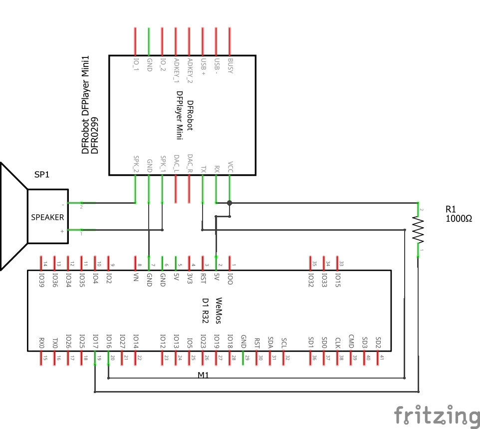

# ESP32 Smart Speaker via Blynk

IoT speaker system using ESP32, DFPlayer Mini and Blynk Cloud.

## Features
- Play music remotely
- Pause music
- Next / Previous track
- Volume slider control
- WiFi cloud control via Blynk

## Hardware
- ESP32 DevKit V1
- DFPlayer Mini
- Speaker
- Resistor 1kΩ
- Power supply

## Software
- Arduino IDE
- Blynk IoT Platform

## Circuit Diagram

## Author
Binh Yeu AI
